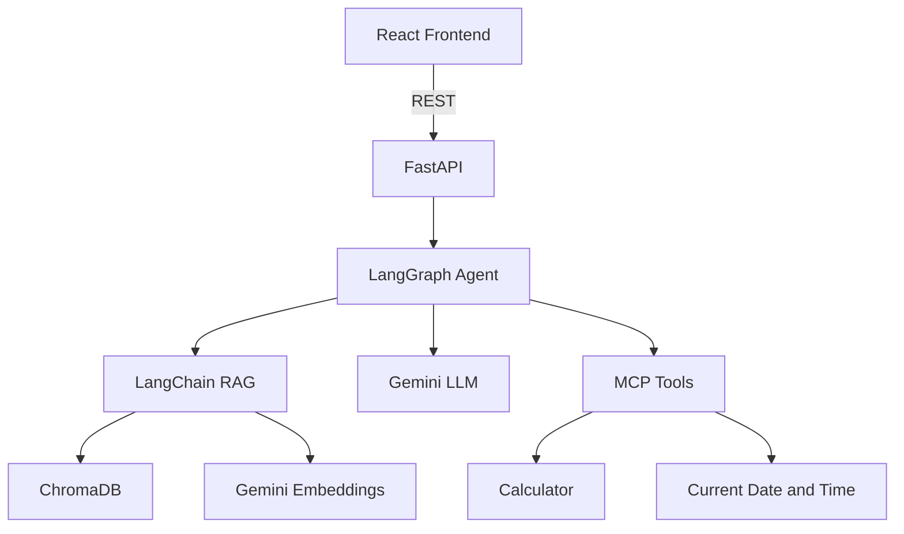

# DocMind AI

DocMind AI is a small document research assistant: upload a PDF, ask questions grounded in its text, and receive answers with page-level source excerpts. A single LangGraph routes arithmetic and current date/time questions to lightweight MCP tools.

## Features

- PDF upload, text extraction, chunking, embeddings, and persistent ChromaDB storage
- Document-grounded chat with source pages
- A simple LangGraph route for document retrieval, calculator, or current UTC date/time
- FastAPI async endpoints, React/Vite interface, Docker Compose, and Kubernetes examples

## Architecture



## Tech stack

React, Vite, JavaScript, Python, FastAPI, LangChain, LangGraph, Google Gemini chat and embedding models, ChromaDB, MCP Python SDK, Docker, and Kubernetes.

## Project structure

```text
docmind-ai/
├── frontend/                 # React app, Vite config, and Nginx container
├── backend/
│   ├── app/
│   │   ├── agents/           # LangGraph routing workflow
│   │   ├── api/              # Upload and chat endpoints
│   │   ├── mcp/              # MCP tool server and safe tool functions
│   │   └── rag/              # PDF loading, embeddings, Chroma, retrieval
│   ├── Dockerfile
│   └── requirements.txt
├── k8s/                      # Minimal Deployments and Services
├── docker-compose.yml
└── .env.example
```

## Local setup

Requirements: Python 3.11+, Node.js 20+, and a Google AI Studio API key with Gemini API access.

### Environment

From the project root, create the ignored `.env` file and add your key:

```bash
cp .env.example .env
# Edit .env and set GOOGLE_API_KEY
```

Environment variables:

| Variable | Description | Default |
|---|---|---|
| `GOOGLE_API_KEY` | Google AI Studio API key for Gemini chat and embeddings | Required |
| `LLM_MODEL` | Gemini chat model | `gemini-3.7-flash` |
| `EMBEDDING_MODEL` | Gemini embedding model | `gemini-embedding-2-preview` |
| `CHROMA_DIR` | Persistent Chroma data directory | `data/chroma` |
| `UPLOAD_DIR` | Temporary upload directory | `data/uploads` |

### Run the backend

Linux/macOS:

```bash
cd backend
python -m venv .venv
source .venv/bin/activate
pip install -r requirements.txt
uvicorn app.main:app --reload
```

The API is at `http://localhost:8000`; interactive API docs are at `/docs`.

### Run the frontend

In a second terminal:

```bash
cd frontend
npm install
npm run dev
```

Open `http://localhost:5173`. Vite forwards `/api` requests to the backend.

## API endpoints

| Method | Path | Description |
|---|---|---|
| `GET` | `/api/health` | Returns `{"status":"ok"}` |
| `POST` | `/api/documents/upload` | Multipart PDF upload; returns `document_id`, filename, and chunk count |
| `POST` | `/api/chat` | JSON `{ "question": "...", "document_id": "..." }`; returns answer and source page excerpts |

Chat accepts an optional `document_id`. Document questions should use the ID returned by upload. Calculator and current date/time questions do not need one.

## How RAG works

The upload route validates the PDF, extracts page text with LangChain's `PyPDFLoader`, and splits it into overlapping chunks. LangChain's Google Gemini embedding integration creates vectors, stored persistently in ChromaDB along with page and document metadata. On a document question, the graph retrieves the most relevant chunks for that document and asks the LLM to answer only from the retrieved excerpts. Source excerpts and page numbers are returned alongside the answer.

## LangChain and LangGraph

LangChain provides the PDF loader, recursive text splitter, Gemini embeddings and chat model, and Chroma vector store/retrieval. A single LangGraph `StateGraph` first classifies the request into document, calculator, or datetime, then routes to a small node and returns an answer. The classifier uses structured output from the configured Gemini model.

## MCP tools

`backend/app/mcp/server.py` defines two MCP tools using the MCP Python SDK:

- `calculator(expression)`: safely evaluates basic arithmetic without Python `eval`.
- `current_datetime()`: returns the current UTC timestamp.

The same small functions are called by the LangGraph nodes, avoiding a subprocess for each web request. Run the standalone MCP server over stdio from `backend/` with:

```bash
python -m app.mcp.server
```

Example tool inputs: `{"expression":"125 * 48"}` → `6000`; `current_datetime` takes no input.

## Docker

Copy `.env.example` to `.env` and set the key, then run from the project root:

```bash
docker compose up --build
```

Open `http://localhost:8080`; the backend is also available on port 8000. Chroma's data is stored in the `docmind-data` Docker volume. Stop with `docker compose down`. To clear local demo data, remove the named volume explicitly with `docker volume rm docmind-ai_docmind-data`.

## Kubernetes

Build the images and make them available to your cluster (for example, load them into a local kind cluster):

```bash
docker build -t docmind-ai-backend:latest ./backend
docker build -t docmind-ai-frontend:latest ./frontend
kubectl create secret generic docmind-secrets --from-literal=google-api-key="$GOOGLE_API_KEY"
kubectl apply -f k8s/
kubectl get deployments,services
kubectl port-forward service/docmind-frontend 8080:80
```

The example backend uses `emptyDir` for Chroma data, so data is lost when its pod is replaced. For durable cloud use, attach a persistent volume or use managed object/vector storage. The frontend Nginx config proxies `/api` to the in-cluster backend Service.

## Cloud deployment

Build and push the two Docker images to a container registry, then deploy them to a managed container platform or Kubernetes service. Configure `GOOGLE_API_KEY` as a platform secret, set the model variables, and attach persistent storage for Chroma. Use HTTPS through the platform ingress/load balancer. No cloud-specific infrastructure is required by this project.

## Example questions

After uploading a PDF:

- “What is this document about?”
- “According to the PDF, what is the revenue?”
- “Summarize the key recommendations.”
- “What is 125 * 48?”
- “What is today's date?”

The arithmetic and date/time prompts exercise the MCP-backed tool nodes; document prompts return source references.

## Future improvements

Add per-user access controls, support more file types, improve retrieval with reranking, add streaming responses, and move Chroma data to durable managed storage for production deployments.
